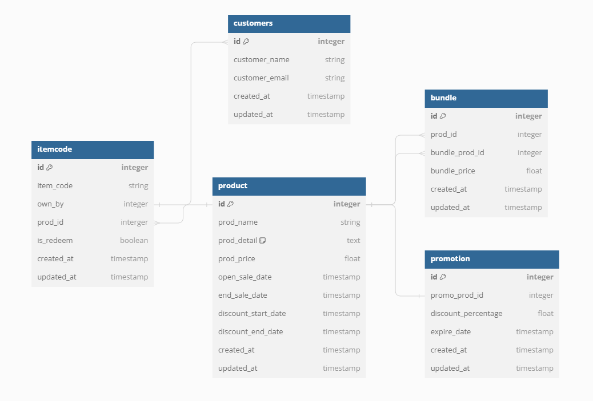

# chomchob

### Setup
1. Install dependencies: `npm install`
2. Setup database: `npm run db:up`

### Run
- Local development: `npm run dev`
- Production build: `npm run build && npm start`

### ER Diagram
- Details: https://dbdiagram.io/d/654f487a7d8bbd6465f8d00c

